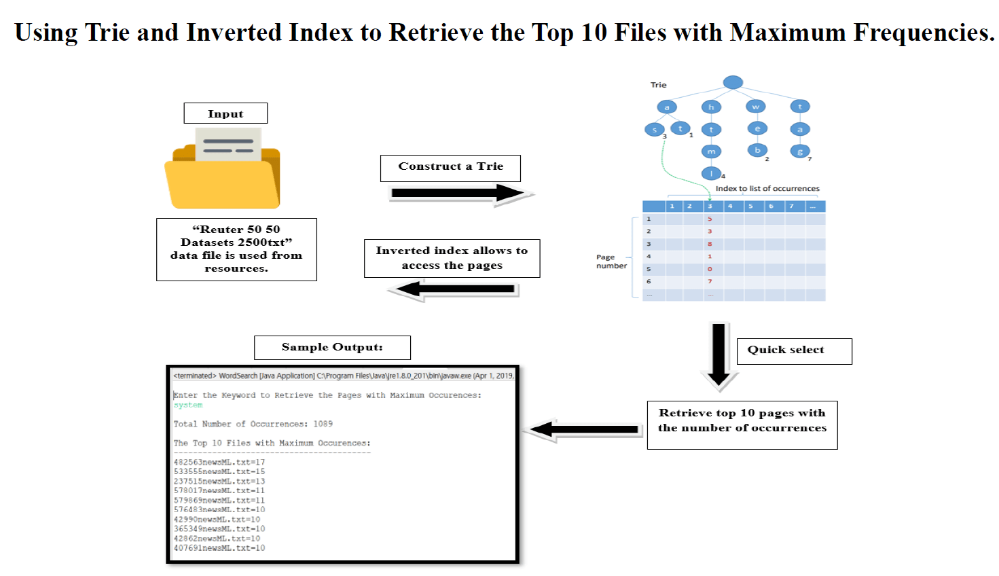
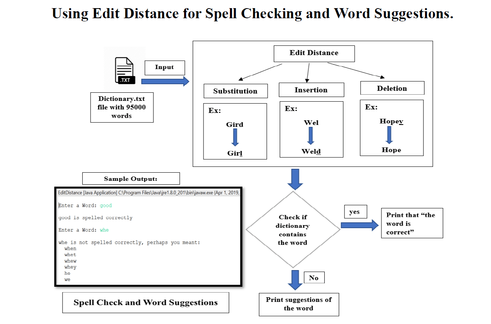
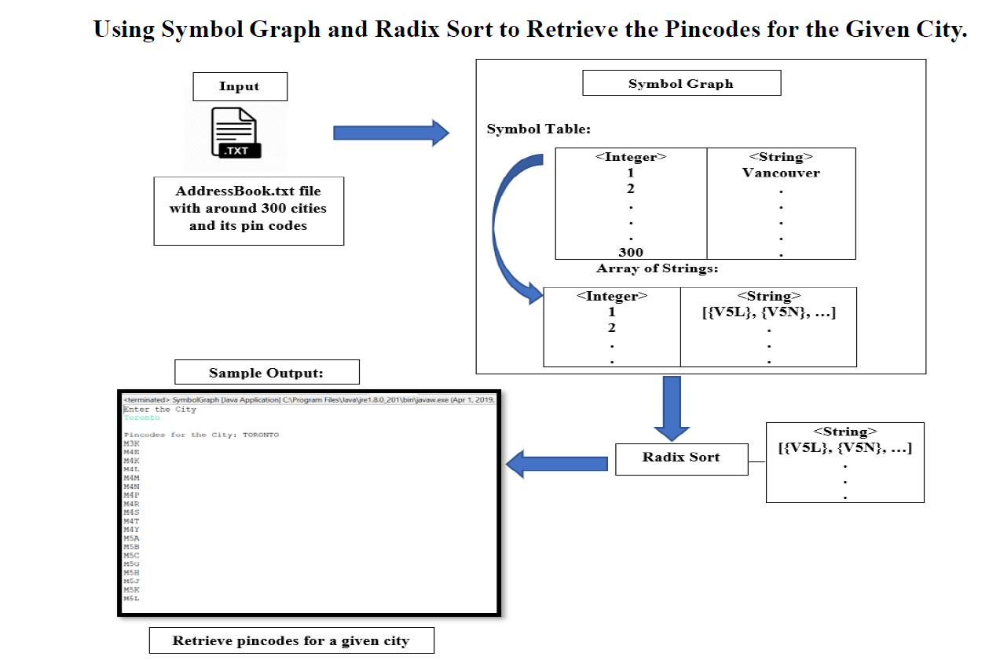
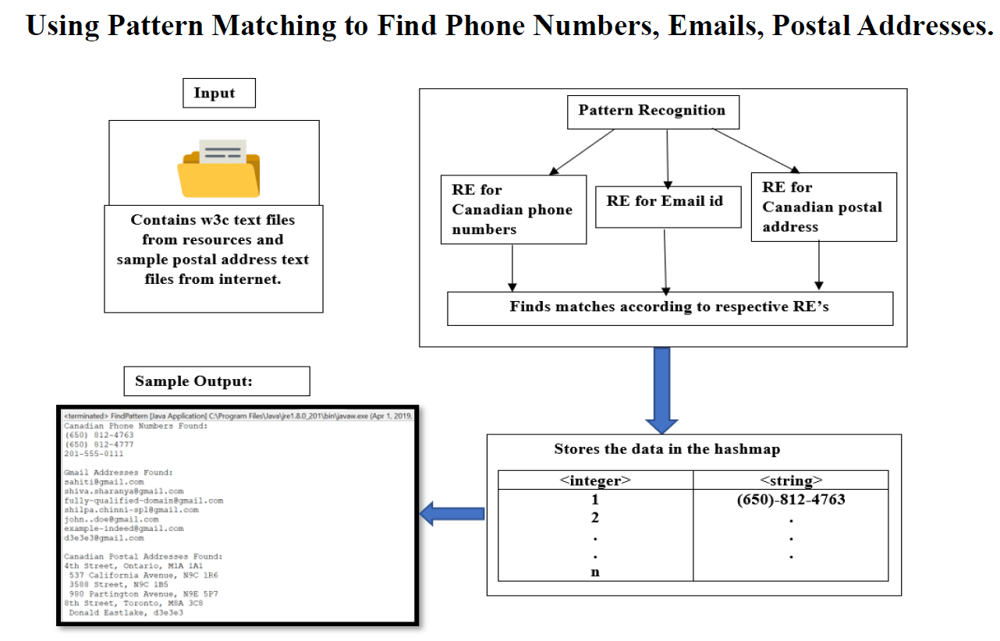

# WEB SEARCH ENGINE

> A Web Search Engine using the concepts of Trie and Quick Select to retrieve the top 10 files with maximum occurrences of the search word, Edit Distance for Spell Checking, Symbol Graph and Radix Sort to store and retrieve pin codes of Cities, Pattern Matching for finding desired patterns of phone no and email; programmed in Java

## Table of contents
* [Technologies](#technologies)
* [Screenshots](#screenshots)
* [Contact](#contact)

## Technologies
* Technologies - Java

## Screenshots
 

## Contact
[Sabiha Begum Jaggir Hussain](https://sabihabegumj.com/) - feel free to contact me!
